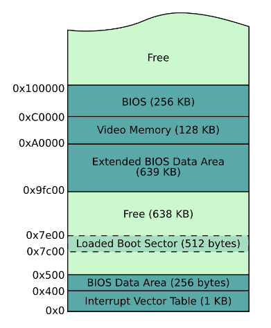

# notes

## register usage rule

volatile (caller saved): rax, rcx, rdx

non-volatile: others

arguments and return value: rax, rcx, rdx, stack

## bootloader(legacy) memory model

- common

0x7c00 - 0x7e00 : bootloader.img, executes from beginning 0x7c00  
0x7e00 - 0x17c00 : kernel.img, called by bootloader, from beginning 0x7e00

- bios age

- 32bit protected mode age

Just used this mode to launch 64bit long mode. No paging enabled. 

- 64bit long mode age

0x1000 - 0x5000 : 64bit long mode paging table**s**
0x00000000 - 0x00200000 : 512 * 4K pages, before the kernel initializing page table in C++.

## bootloader(legacy) disk model

0-511Byte : bootloader.img from boot.asm, MBR flag  
512B - 64KiB : kernel.img. executes from 512Byte first instruction. 

